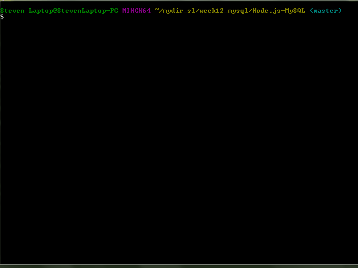
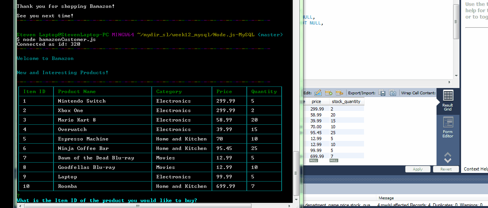

# Node.js-MySQL
================

## Overview
In this activity, you'll be creating an Amazon-like storefront with the MySQL skills you learned this week. The app will take in orders from customers and deplete stock from the store's inventory. As a bonus task, you can program your app to track product sales across your store's departments and then provide a summary of the highest-grossing departments in the store.

Make sure you save and require the MySQL and Inquirer npm packages in your homework files--your app will need them for data input and storage.

## Submission Guide

Make sure you use the normal GitHub. Because this is a CLI App, there will be no need to deploy it to Heroku. This time, though, you need to include screenshots, a gif, and/or a video showing us that you got the app working with no bugs. You can include these screenshots or a link to a video in a README.md file.

Include screenshots (or a video) of typical user flows through your application (for the customer and if relevant the manager/supervisor). This includes views of the prompts and the responses after their selection (for the different selection options).

Include any other screenshots you deem necessary to help someone who has never been introduced to your application understand the purpose and function of it. This is how you will communicate to potential employers/other developers in the future what you built and why, and to show how it works.

Because screenshots (and well-written READMEs) are extremely important in the context of GitHub, this will be part of the grading.


## Working File Images
```
This demo runs through different buying scenarios.  

Confirmations to continue buying -- shows the app calculating different quantities and 
updating the inventory.  Inventory updates once the 'continue shopping' prompt is answered yes or no.  

One scenario where quantity desired exceeds available inventory. 
---------------------------------------------------------------------------
Item is in stock...
*Prompts the user to select an item, then quantity.
*Confirmation that item is in stock & notice that order is being prepared.
*Confirmation that order is ready and total price displayed.

Prompt to continue shopping.  Y/N  
*Inventory will update with either Y/N answer.

If answer is Yes and item is not available...
*Prompts the user to select an item, then quantity.
*Quantity chosen exceeds inventory -> confirmation item is unavailable, asks user to select another item, 
confirms quantity that is available

Prompt to continue shopping.  Y/N  
*Select N -> Thanks user for shopping Bamazon. 

```


```
Demo of node application working with mysql database to update inventory with each purchase.
```




## Instructions

### Challenge #1: Customer View (Minimum Requirement)

Create a MySQL Database called bamazon.

Then create a Table inside of that database called products.

The products table should have each of the following columns:

```
item_id (unique id for each product)

product_name (Name of product)

department_name

price (cost to customer)

stock_quantity (how much of the product is available in stores)
```

Populate this database with around 10 different products. (i.e. Insert "mock" data rows into this database and table).

Then create a Node application called bamazonCustomer.js. Running this application will first display all of the items available for sale. Include the ids, names, and prices of products for sale.

The app should then prompt users with two messages.

```
The first should ask them the ID of the product they would like to buy.
The second message should ask how many units of the product they would like to buy.
```

Once the customer has placed the order, your application should check if your store has enough of the product to meet the customer's request.
```
If not, the app should log a phrase like Insufficient quantity!, and then prevent the order from going through.
```

However, if your store does have enough of the product, you should fulfill the customer's order.

```
This means updating the SQL database to reflect the remaining quantity.
Once the update goes through, show the customer the total cost of their purchase.
```
If this activity took you between 8-10 hours, then you've put enough time into this assignment. Feel free to stop here -- unless you want to take on the next challenge.


